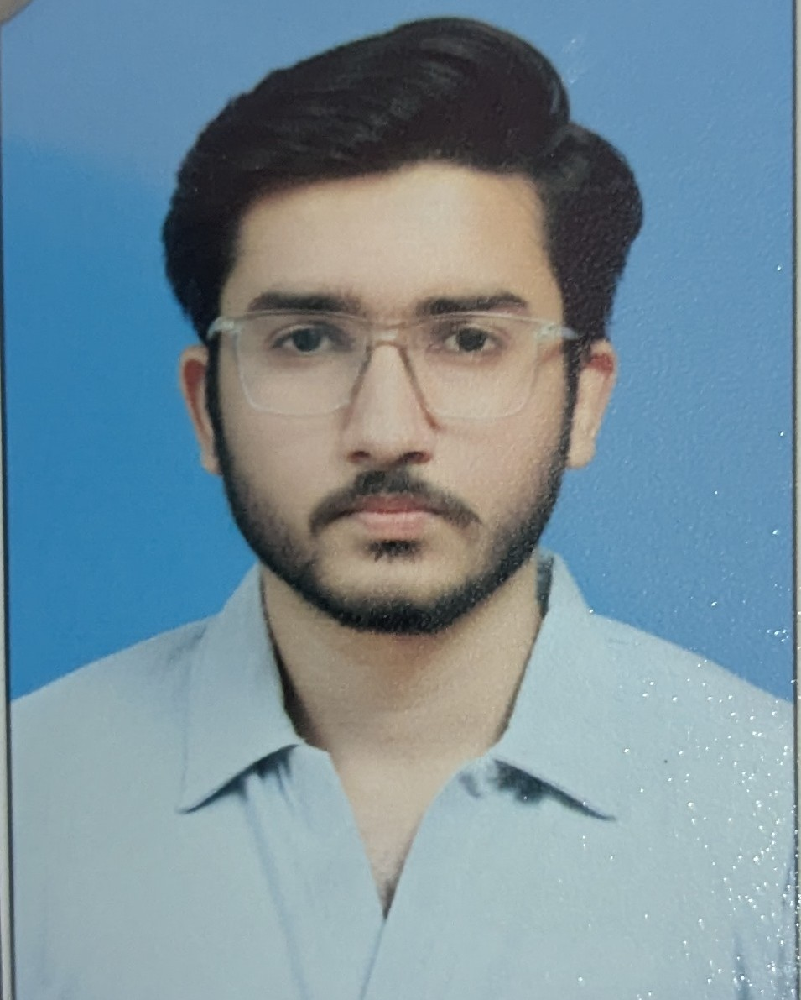

# MOHAMMED AHMED MINHAS

## Education
- **Undergraduate Student** - *FAST University*
- **Diploma in Software & AI** - *Aptech Learning*
- **A Levels** - *Private*
- **O Levels** - *Happy Palace Grammar School*

## Skills
- Machine Learning & AI Engineering
- Full-Stack Web Development (MERN & ASP.NET)[cite: 2]
- SQL Server & Data Analysis[cite: 2]
- MLOps, Docker & CI/CD Pipelines[cite: 2]

## Projects
- **Custom NLP Chatbot** - *Upwork*
  - Built and deployed a custom NLP chatbot application using Docker and CI/CD
- **Accounting & LMS Web Applications** - *Upwork*
  - Developed and deployed full-stack web platforms for accounting and learning management systems.
- **Data Cleaning & Analysis Pipeline** - *Upwork*
  - Processed, cleaned, and structured raw datasets for analytical workflows.

## Hobbies & Extracurriculars
1. Private Tutoring & Mentorship
   - [x] Teach Mathematics and Science to O Level students
   - [x] Expand teaching to coaching centers
   - [ ] Create online video lectures for student revision
2. Playing E-Games & Strategy Gaming
3. Watching Movies & Cinema
4. Playing Sports & Physical Fitness
5. Exploring AI & Learning New Technologies
